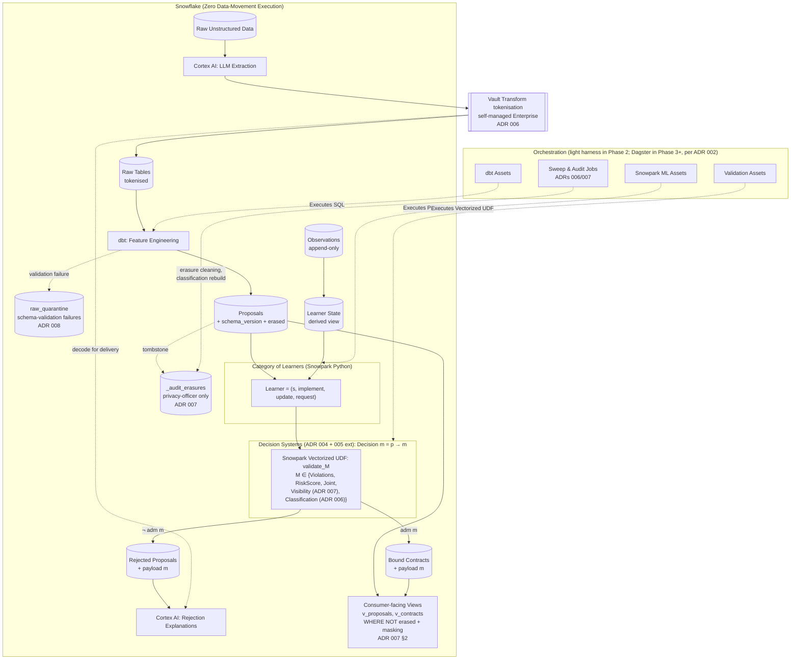

# Architecture: Categorical Insurance on Snowflake

This document outlines the architecture for porting the `hx` categorical
insurance framework from Haskell to a Python-centric modern data stack
built on Snowflake.

The architecture decisions behind each component are recorded in
`docs/adr/`; the staged rollout from a laptop MVP to this architecture
is in `docs/PHASES.md`. Unless otherwise noted, the diagram below
depicts the **Phase 3+ steady state**; earlier phases use a
lightweight Python harness in place of Dagster (per ADR 002) and may
not yet exhibit the DMN authoring surface or every monoid choice.

## System Architecture

The architecture maps the categorical concepts of the original Haskell
implementation — Learners as morphisms, decisions as co-Kleisli arrows
valued in a monoid `M`, validation as a static guarantee on contract
construction — into distributed data-engineering primitives.

<!--

  

-->

## Concept Mapping

### 1. State (`s`)
*   **Haskell:** Hidden state in the `Learner` existential type.
*   **Python/Snowflake:** State is *derived* from an append-only
    `observations` table via a SQL view (Phase 2). "Current state" is
    reproducible from history rather than mutable in place; Snowflake
    `TIME TRAVEL` recovers state-at-time-T for free. This restores
    most of the categorical encapsulation of the Haskell existential
    `s` even though anyone with `SELECT` can read the derived view.
    See ADR 003's *Category Model Fidelity* section for the
    encapsulation regression we accept and the mitigations that
    contain it.

### 2. The Category of Learners
*   **Haskell:** Optic-like quadruples (`State`, `Implement`,
    `Update`, `Request`) composed sequentially and in parallel.
*   **Python/Snowflake:** Snowpark Python functions running natively
    on Snowflake compute nodes for forward passes (`implement`),
    parameter updates (`update`), and input gradients (`request`). For
    closed-form learners (Bühlmann credibility, GLMs) Snowpark Python
    is ergonomic; for substantive gradient learners we expect to read
    state from Snowflake, train in external Python (PyTorch / JAX)
    where tensor work is most ergonomic, and write the updated state
    back. The categorical "category of learners" lives at the type
    level uniformly; only the runtime varies.

### 3. Decision Systems and Validation
*   **Haskell:** A `Decision m p = p -> m` for monoid `m`, with a
    `validate_{m, adm}` co-Kleisli arrow that returns a constructed
    `Contract` when `adm(aggregate(decisions, p))` holds and the
    aggregate `m` (in the left summand) otherwise. Governance is the
    `m = [Violation]` instance with `adm(m) = (m == [])`; Guardrails
    are the case where `m` is a richer monoid (additive risk score,
    score-and-worst-severity product, …) with a thresholding `adm`.
    See `math.tex` §VI and ADRs 004 and 005.
*   **Python/Snowflake:** *One* vectorized Snowpark UDF
    *implementation* parameterised by `m`, registered as one or more
    *instances*, one per active monoid (per ADR 004). The UDF returns
    `(admitted: bool, m: m)` per row; both contracts and rejections
    persist the `m` payload alongside the boolean admission, so
    downstream analytics can reason about the decision without
    re-running the rules.

### 4. Authoring Surfaces for Decisions
*   **Python predicates** are the first-class authoring surface
    (ADR 004 S1; available from Phase 0). `Decision[m]` modules live
    in version control alongside the rest of the codebase, are tested
    in `pytest`, type-checked, and debuggable.
*   **DMN tables with FEEL** cell expressions are the additional
    authoring surface adopted in Phase 4 for actuaries, underwriters,
    and compliance staff (ADR 004 S2). A build step compiles each
    table into a `Decision[m]` (the hit policy determines `m`); a
    Decision Requirements Diagram of several tables compiles into a
    co-Kleisli composite. The compiled Python is what the UDF runs.
*   **Imported regulator/partner DMN bundles** (S3) are translated by
    the same compilation path on demand.
*   **Rego** was considered (ADR 001 original framing, then ADR 004
    once DMN entered the picture) and not adopted; DMN occupies the
    "industry-standard declarative format" niche better for insurance
    specifically.

### 5. Governance and Guardrails — Same Substrate, Different Monoids
*   **Governance** is the case `m = list[Violation]`,
    `adm = (m == [])`. Hard rejections; conjunctive composition.
*   **Guardrails** are decisions valued in any other monoid — an
    additive risk score (`m = float`), a score-and-worst-severity
    product, an advisory list — with a thresholding `adm` (per
    ADR 005). Both flavours run through the same UDF.
*   **Joint** decision systems use the product monoid, e.g.
    `m = list[Violation] × float`, with admission the conjunction of
    the components'. A single UDF call evaluates both.
*   In analytics, governance violations belong in a per-violation side
    table (one row per `(contract_id, rule_name)` pair), whereas
    guardrail outputs belong in the `m` payload column on the contract
    row. The differing algebras imply differing analytical surfaces.

### 6. Optics & Feature Engineering
*   **Haskell:** Pure functions mapping external types into learner
    input types `A`.
*   **Python/Snowflake:** `dbt` is used strictly for the
    forward-propagation of features. It shapes raw data into the
    `Proposal` formats expected by the learners. The `Proposal` schema
    is Pydantic at the Python boundary and a `dbt` source contract at
    the SQL boundary; the two are generated from one source so they
    cannot drift (Phase 2). The same source-of-truth Pydantic model
    also drives PII classification (ADR 006 §1) and the
    `MASKING POLICY` / view-emulation DDL emitted per target tier
    (ADR 006 §7) — one classification labelling decision system
    feeds runtime, the dbt YAML generator, and the masking-policy
    compiler.

### 7. Orchestration
*   **Haskell:** In-memory execution or manual GHCi REPL steps.
*   **Python/Snowflake:** Per ADR 002, orchestration adopts in two
    phases. Phase 2 uses a *lightweight Python harness* (a single
    `pipeline.py` invoking `dbt run` and the Snowpark validation UDF
    in order, scheduled by GitHub Actions, cron, or a Snowflake Task).
    Phase 3 migrates to **Dagster** when the asset graph or the demand
    for ops-visible lineage justifies the operational footprint. Once
    in Dagster, dbt models, Snowflake state views, and Contract tables
    are first-class Software-Defined Assets, with asset checks running
    continuously to formalise the invariants — governance always
    satisfied on the `contracts` table; guardrail-score distribution
    within learned band; Cortex spend within budget.

### 8. Cortex at the Boundaries
*   `Cortex EXTRACT_ANSWER` (or similar) at the source converts
    unstructured inputs (PDFs, adjuster notes) into structured
    `Proposal` records — a "boundary functor" entering the category
    of learners, not a learner inside it.
*   `Cortex` post-processing of rejection payloads produces
    human-readable rejection letters from a violation list and the
    `m` payload — also a boundary functor; not composed with learners.
*   Cortex sits **inside the Vault tokenisation boundary** on both
    faces (ADR 003 revised, ADR 006). Extraction reads raw text
    containing direct identifiers; the structured output is routed
    through `Vault.encode` before warehouse landing. Explanation
    reads tokenised violations from the warehouse and decodes via
    Vault to render letter content for delivery; the plaintext
    rendered letter is a delivery artefact, not a warehouse
    artefact. Cortex is therefore a **PII-handling subprocessor**
    requiring the same vendor-management discipline as Vault
    (BAA / DPA, no caching, no logging of plaintext in scope).
*   See ADR 003 for the discipline that keeps Cortex out of the
    categorical core. The reasoning, summarised: Cortex models do not
    expose a `request` map, so they cannot participate in sequential
    composition; we use them only at the inlet and outlet, where
    composition with learners is not required.

### 9. Privacy and Boundaries
Three intersecting concerns shape the runtime PII story; each has a
dedicated ADR and each surfaces in the diagram above.

*   **Classification (ADR 006).** The Pydantic `CanonicalProposal`
    annotates each field with a `PII` marker (direct, quasi,
    financial, health) and the regulatory regimes that apply.
    Annotation lives next to the type and is the single source of
    truth — for the dbt source-contract generator, the masking-
    policy compiler, the Vault role-to-field mapping, and the
    audit-snapshot scrubber. CI fails on a new sensitive field that
    lacks classification. Categorically this is a *labelling*
    decision system per math.tex §VI (ADR 005 extension); operationally
    it is the metadata that drives every protection mechanism below.
*   **Protection at rest (ADR 006).** Direct identifiers tokenise at
    ingest via the self-managed Vault Enterprise Transform engine;
    quasi-identifiers are masked at read time via Snowflake Dynamic
    Data Masking on the Enterprise tier or via view-based emulation
    on the Standard / DuckDB tiers. The hot read path is DDM-only;
    the vault is touched at ingest and at the rare delivery-time
    decode (rejection letters).
*   **Visibility (ADR 007).** The view-layer filter
    `WHERE erased = false` is the consumer-facing realisation of a
    *visibility guardrail* — a decision system valued in a
    visibility lattice with meet monoid and per-query admission. The
    erasure tombstone is the data primitive on which the visibility
    decision evaluates. Adding a new visibility rule (litigation
    hold, claims hold) is one new decision module composing via the
    meet monoid; the view layer's `WHERE` clause is regenerated by
    the dbt macro.
*   **Schema evolution (ADR 008).** Every persisted proposal and
    contract carries `schema_version` and `schema_effective_date`.
    Version-specific Pydantic models (`ProposalV1`, `ProposalV2`)
    parse versioned rows; SQL view-layer projection (`v_proposals`)
    presents a uniform shape across versions for analytical
    consumers. Erased rows are immutable across versions; the
    `_audit_erasures` snapshot carries the version that was erased.
*   **Access control (delegated).** Snowflake DDM and Row Access
    Policies enforce who-sees-what at planner cost. ADR 005's 2026-
    04-30 extension records the line: the categorical substrate is
    not the right layer for access control; the warehouse policy
    engine is.
*   **Secret resolution (delegated to fnox).** Snowflake credentials,
    Vault tokens, and SIEM API keys all flow through fnox env-var
    injection. Code reads `os.environ`; fnox sources from age-
    encrypted git in dev, from cloud secret manager in CI and prod.
    Same `mise run` invocation everywhere.

## References

* `docs/math.tex` — formal mathematical development, including §VI
  on monoid-parameterised decision systems and Theorem 14
  (Generalised Static Admissibility).
* `docs/adr/001-governance-locality.md` — original governance
  evaluation locality decision: Python rule DSL inside a Snowpark
  vectorized UDF, with experimental criteria for Rego.
* `docs/adr/002-orchestration-dagster.md` — phased orchestration:
  light Python harness → Dagster.
* `docs/adr/003-learners-vs-cortex.md` — discipline keeping Cortex at
  the boundaries.
* `docs/adr/004-decision-systems.md` — `Decision[M]` substrate;
  Python and DMN as peer authoring surfaces; Rego considered, not
  adopted.
* `docs/adr/005-governance-vs-guardrails.md` — Governance and
  Guardrails as monoid choices on the same substrate; the
  2026-04-30 extension adds Visibility (worked instance: erasure)
  and Labelling (worked instance: PII classification) as further
  flavours.
* `docs/adr/006-pii-handling.md` — PII classification, Vault
  tokenisation, DDM, RBAC + ABAC, ACCESS_HISTORY + SIEM, dual-tier
  dev/prod via classification-driven generators, fnox secret
  resolution.
* `docs/adr/007-right-to-erasure.md` — tombstone-with-PII-null,
  view-layer visibility filter, US-GLBA-only scope, irreversible
  and idempotent semantics, separate `_audit_erasures` table.
* `docs/adr/008-schema-and-contract-evolution.md` — integer + date
  versioning, hybrid additive-within-major + multi-version
  coexistence across majors, `schema_version` on every row,
  ingest-side validation with quarantine, tiered governance.
* `docs/PHASES.md` — staged rollout from MVP to this architecture.
