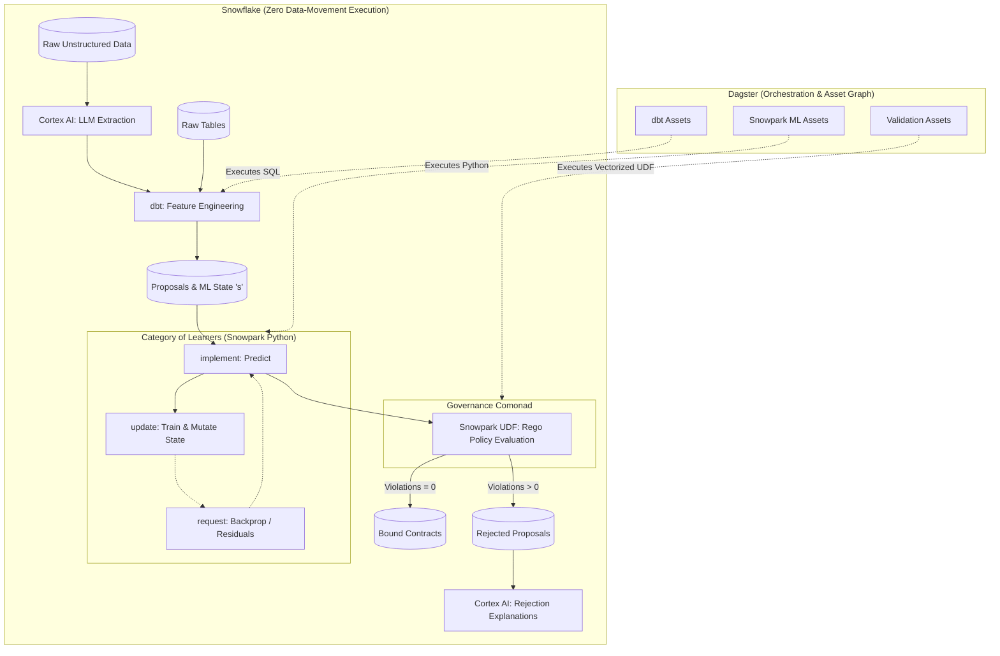

# Architecture: Categorical Insurance on Snowflake

This document outlines the architecture for porting the `hx` categorical insurance framework from Haskell to a Python-centric modern data stack built on Snowflake.

## System Architecture

The architecture maps the rigorous functional concepts of the original
Haskell implementation (Learners as morphisms, Governance as a
comonad, validation as a co-Kleisli arrow) into distributed data
engineering primitives.

<!--

  

-->

## Concept Mapping

### 1. State ($s$)
*   **Haskell:** Hidden state in the `Learner` existential type.
*   **Python/Snowflake:** State parameters (e.g., weights, credibility factors) are persisted in Snowflake tables. Snowpark Python reads this state during training loops and writes the updated state $s'$ back to the tables.

### 2. The Category of Learners
*   **Haskell:** Optic-like quadruples (`State`, `Implement`, `Update`, `Request`) composed sequentially and parallelly.
*   **Python/Snowflake:** Snowpark Python functions that execute natively on Snowflake compute nodes. They manipulate Snowpark DataFrames to run forward passes (`implement`) and backward passes (`request`/`update`) natively without moving data to the orchestration layer.

### 3. Governance Comonad & Co-Kleisli Validation
*   **Haskell:** The `Governed` comonad carrying a `Monoid` of rules, evaluated via `validate` to produce a `Contract` or `Violations`.
*   **Python/Snowflake:** Open Policy Agent (OPA) / Rego rules stored in the repository. These policies are executed *inside* Snowflake via Vectorized Python UDFs. A record only enters the `Contracts` table if the Rego evaluation returns an empty violation array.

### 4. Optics & Feature Engineering
*   **Haskell:** Pure functions mapping external types into learner input types $A$.
*   **Python/Snowflake:** `dbt` is used strictly for the forward-propagation of features. It shapes raw data into the `Proposal` formats expected by the learners.

### 5. Orchestration
*   **Haskell:** In-memory execution or manual GHCi REPL steps.
*   **Python/Snowflake:** **Dagster** manages the end-to-end lineage. It treats intermediate tables, ML state, and final contracts as Software-Defined Assets (SDAs), triggering dbt, Snowpark, and validation UDFs in the correct order based on data freshness.
